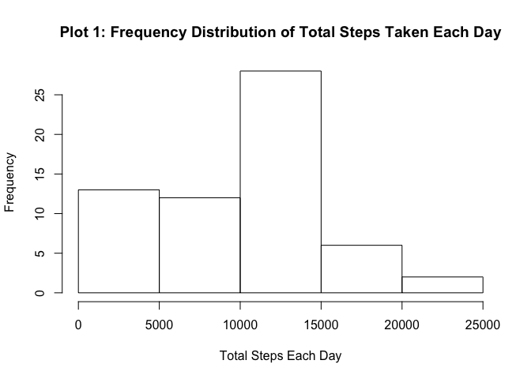
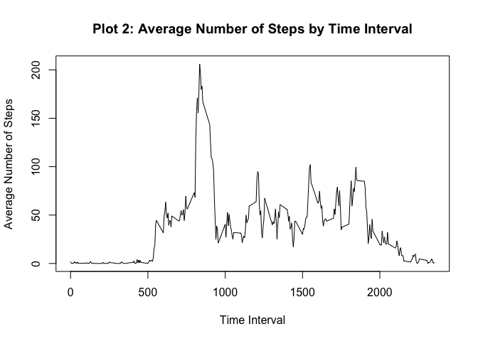
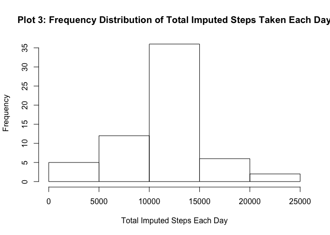
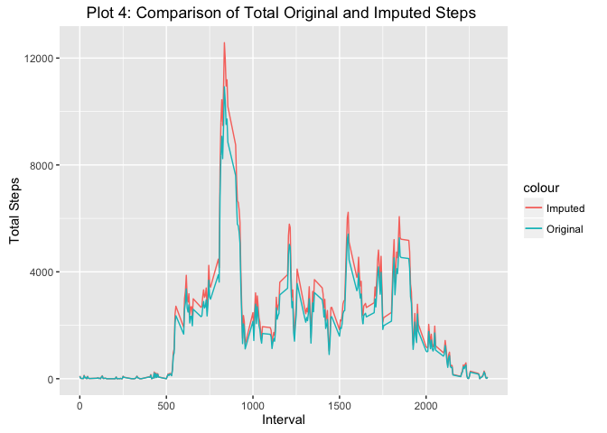
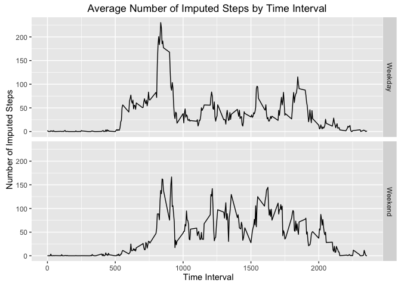

# Reproducible Research: Peer Assessment 1
Sharon Francisco  

## Installing packages and loading libraries

This step is not required by the assignment, but since I used these packages, I included them in the report.


```r
if(!require(dplyr, quietly = TRUE)) install.packages("dplyr")
```

```
## 
## Attaching package: 'dplyr'
```

```
## The following objects are masked from 'package:stats':
## 
##     filter, lag
```

```
## The following objects are masked from 'package:base':
## 
##     intersect, setdiff, setequal, union
```

```r
library(dplyr)

if(!require(lubridate, quietly = TRUE)) install.packages("lubridate")
```

```
## 
## Attaching package: 'lubridate'
```

```
## The following object is masked from 'package:base':
## 
##     date
```

```r
library(lubridate)

if(!require(ggplot2, quietly = TRUE)) install.packages("ggplot2")
library(ggplot2)
```

The next step is not required, but I like to clear the variables in the environment before running new code.


```r
rm(list = ls())
```

## Loading and preprocessing the data

The assignment does not require the code for downloading the file, but I included it for the sake of completeness.


```r
fileUrl <- "https://d396qusza40orc.cloudfront.net/repdata%2Fdata%2Factivity.zip"
download.file(fileUrl, destfile = "activity.zip", method = 
                      "curl")
```

```
## Warning in download.file(fileUrl, destfile = "activity.zip", method =
## "curl"): download had nonzero exit status
```

```r
dateDownloaded <- now()
```

This assignment makes use of data from a personal activity monitoring device. This device collects data at 5 minute intervals throughout the day. The data consists of two months of data from an anonymous individual collected during the months of October and November 2012 and include the number of steps taken in 5 minute intervals each day.

The Activity Monitor Data was downloaded from <https://d396qusza40orc.cloudfront.net/repdata%2Fdata%2Factivity.zip> on 2016-06-10 13:39:54.

1. Load the data.


```r
unzip("activity.zip")
activityOrigDf <- read.csv("activity.csv", header = TRUE)
```

2. Process/transform the data (if necessary) into a format suitable for your analysis.

- I use dplyr in the code so I tranformed the data to a data frame table.


```r
activityOrigDfTbl <- tbl_df(activityOrigDf)
print(activityOrigDfTbl)
```

```
## Source: local data frame [17,568 x 3]
## 
##    steps       date interval
##    (int)     (fctr)    (int)
## 1     NA 2012-10-01        0
## 2     NA 2012-10-01        5
## 3     NA 2012-10-01       10
## 4     NA 2012-10-01       15
## 5     NA 2012-10-01       20
## 6     NA 2012-10-01       25
## 7     NA 2012-10-01       30
## 8     NA 2012-10-01       35
## 9     NA 2012-10-01       40
## 10    NA 2012-10-01       45
## ..   ...        ...      ...
```

```r
summary(activityOrigDfTbl)
```

```
##      steps                date          interval     
##  Min.   :  0.00   2012-10-01:  288   Min.   :   0.0  
##  1st Qu.:  0.00   2012-10-02:  288   1st Qu.: 588.8  
##  Median :  0.00   2012-10-03:  288   Median :1177.5  
##  Mean   : 37.38   2012-10-04:  288   Mean   :1177.5  
##  3rd Qu.: 12.00   2012-10-05:  288   3rd Qu.:1766.2  
##  Max.   :806.00   2012-10-06:  288   Max.   :2355.0  
##  NA's   :2304     (Other)   :15840
```


## What is mean total number of steps taken per day?
1. Calculate the total number of steps taken per day.
2. see below
3. Calculate and report the mean and median of the total number of steps taken per day.


```r
totalStepsByDay <- activityOrigDfTbl %>%
        group_by(date) %>%
        summarize(totalSteps = sum(steps, na.rm = TRUE),
                  mean = mean(steps, na.rm = TRUE),
                  median = median(steps, na.rm = TRUE))
print(totalStepsByDay)
```

```
## Source: local data frame [61 x 4]
## 
##          date totalSteps     mean median
##        (fctr)      (int)    (dbl)  (dbl)
## 1  2012-10-01          0      NaN     NA
## 2  2012-10-02        126  0.43750      0
## 3  2012-10-03      11352 39.41667      0
## 4  2012-10-04      12116 42.06944      0
## 5  2012-10-05      13294 46.15972      0
## 6  2012-10-06      15420 53.54167      0
## 7  2012-10-07      11015 38.24653      0
## 8  2012-10-08          0      NaN     NA
## 9  2012-10-09      12811 44.48264      0
## 10 2012-10-10       9900 34.37500      0
## ..        ...        ...      ...    ...
```

2. Make a histogram of the total number of steps taken each day.


```r
plot1 <- hist(totalStepsByDay$totalSteps, xlab = "Total Steps Each Day",
     main = "Plot 1: Frequency Distribution of Total Steps Taken Each Day")
```




## What is the average daily activity pattern?
1. Make a time series plot of the 5-minute interval (x-axis) and the average number of steps taken, averaged across all days (y-axis).


```r
avgStepsByInterval <- activityOrigDfTbl %>%
        group_by(interval) %>%
        summarize(avgSteps = mean(steps, na.rm = TRUE), 
                  totalSteps = sum(steps, na.rm = TRUE))
print(avgStepsByInterval)
```

```
## Source: local data frame [288 x 3]
## 
##    interval  avgSteps totalSteps
##       (int)     (dbl)      (int)
## 1         0 1.7169811         91
## 2         5 0.3396226         18
## 3        10 0.1320755          7
## 4        15 0.1509434          8
## 5        20 0.0754717          4
## 6        25 2.0943396        111
## 7        30 0.5283019         28
## 8        35 0.8679245         46
## 9        40 0.0000000          0
## 10       45 1.4716981         78
## ..      ...       ...        ...
```

```r
plot2 <- with(avgStepsByInterval, plot(interval, avgSteps, type = "l", 
        xlab = "Time Interval", ylab = "Average Number of Steps",
        main = "Plot 2: Average Number of Steps by Time Interval"))
```



2. Which 5-minute interval, on average across all the days in the dataset, contains the maximum number of steps?


```r
summary(avgStepsByInterval)
```

```
##     interval         avgSteps         totalSteps     
##  Min.   :   0.0   Min.   :  0.000   Min.   :    0.0  
##  1st Qu.: 588.8   1st Qu.:  2.486   1st Qu.:  131.8  
##  Median :1177.5   Median : 34.113   Median : 1808.0  
##  Mean   :1177.5   Mean   : 37.383   Mean   : 1981.3  
##  3rd Qu.:1766.2   3rd Qu.: 52.835   3rd Qu.: 2800.2  
##  Max.   :2355.0   Max.   :206.170   Max.   :10927.0
```

```r
maxInterval <- avgStepsByInterval %>%
        filter(avgSteps == max(avgSteps))
print(maxInterval)
```

```
## Source: local data frame [1 x 3]
## 
##   interval avgSteps totalSteps
##      (int)    (dbl)      (int)
## 1      835 206.1698      10927
```

- Interval 835 has the maximum number of steps, both the average steps and the total steps.

## Imputing missing values
1. Calculate and report the total number of missing values in the dataset (i.e., the total number of rows with **NA**s).


```r
cntNAs <- length(which(is.na(activityOrigDfTbl$steps)))
```
- There are 2304 **NA**s in the dataset.

- Although not required, the next block of code determines which days had **NAs**.


```r
daysNA <- totalStepsByDay %>%
        filter(is.nan(mean))
daysNA
```

```
## Source: local data frame [8 x 4]
## 
##         date totalSteps  mean median
##       (fctr)      (int) (dbl)  (dbl)
## 1 2012-10-01          0   NaN     NA
## 2 2012-10-08          0   NaN     NA
## 3 2012-11-01          0   NaN     NA
## 4 2012-11-04          0   NaN     NA
## 5 2012-11-09          0   NaN     NA
## 6 2012-11-10          0   NaN     NA
## 7 2012-11-14          0   NaN     NA
## 8 2012-11-30          0   NaN     NA
```

2. Devise a strategy for filling in all of the missing values in the dataset. The strategy does not need to be sophisticated. For example, you could use the mean/median for that day, or the mean for that 5-minute interval, etc.

- I decided to substitute the **NA**s with the average steps for the associated 5-minute interval.


```r
## create an empty vector to store the returned values
imputedVectNum <- vector(mode = "numeric", length = 0)
stepTypeVect <- character(length = 0)
## get the total number of observations for the for loop
totalObservations <- as.integer(count(activityOrigDfTbl))
## loop through all the observations in the data set
for(i in 1: totalObservations) {
        ## get the value of the steps column
        test <- activityOrigDfTbl[i, "steps"]
        ## If the value of steps is NA
        if(is.na(test)) {
                ## get the value of the interval column as an integer
                y <- as.integer(activityOrigDfTbl[i, "interval"])
                ## get the row in avgStepsByInterval for the interval
                x <- filter(avgStepsByInterval, interval == y)
                ## get the avgSteps for that interval as a number
                z <- as.numeric(x$avgSteps)
                ## append the avgSteps to imputedVectNum
                imputedVectNum <- c(imputedVectNum, z)
                ## assign the stepType as "Imputed"
                l <- "Imputed"
                ## append the stepType to the vector
                stepTypeVect <- c(stepTypeVect, l)
        } else {
                ## get value of the steps columns as a number
                z <- as.numeric(activityOrigDfTbl[i, "steps"])
                ## append the number of steps to imputedVectNum
                imputedVectNum <- c(imputedVectNum, z)
                ## assign the stepType as "Original"
                l <- "Original"
                ## append the stepType to the vector
                stepTypeVect <- c(stepTypeVect, l)
        }
} 

imputedStepsVect <- imputedVectNum
head(imputedStepsVect)
```

```
## [1] 1.7169811 0.3396226 0.1320755 0.1509434 0.0754717 2.0943396
```

```r
head(stepTypeVect)
```

```
## [1] "Imputed" "Imputed" "Imputed" "Imputed" "Imputed" "Imputed"
```

3. Create a new dataset that is equal to the original dataset but with the missing data filled in.


```r
## add the imputedSteps and stepType vectors to the activity data
activityImputedDfTbl <- activityOrigDfTbl %>%
        mutate(imputedSteps = imputedStepsVect, stepType = stepTypeVect)
head(activityImputedDfTbl)
```

```
## Source: local data frame [6 x 5]
## 
##   steps       date interval imputedSteps stepType
##   (int)     (fctr)    (int)        (dbl)    (chr)
## 1    NA 2012-10-01        0    1.7169811  Imputed
## 2    NA 2012-10-01        5    0.3396226  Imputed
## 3    NA 2012-10-01       10    0.1320755  Imputed
## 4    NA 2012-10-01       15    0.1509434  Imputed
## 5    NA 2012-10-01       20    0.0754717  Imputed
## 6    NA 2012-10-01       25    2.0943396  Imputed
```

```r
summary(activityImputedDfTbl)
```

```
##      steps                date          interval       imputedSteps   
##  Min.   :  0.00   2012-10-01:  288   Min.   :   0.0   Min.   :  0.00  
##  1st Qu.:  0.00   2012-10-02:  288   1st Qu.: 588.8   1st Qu.:  0.00  
##  Median :  0.00   2012-10-03:  288   Median :1177.5   Median :  0.00  
##  Mean   : 37.38   2012-10-04:  288   Mean   :1177.5   Mean   : 37.38  
##  3rd Qu.: 12.00   2012-10-05:  288   3rd Qu.:1766.2   3rd Qu.: 27.00  
##  Max.   :806.00   2012-10-06:  288   Max.   :2355.0   Max.   :806.00  
##  NA's   :2304     (Other)   :15840                                    
##    stepType        
##  Length:17568      
##  Class :character  
##  Mode  :character  
##                    
##                    
##                    
## 
```

4. Make a histogram of the total number of steps taken each day, and calculate and report the **mean** and **median** total number of steps taken per day. 


```r
## summarize imputedSteps by date
imputedByDate <- activityImputedDfTbl %>%
        group_by(date) %>%
        summarize(totalImputedSteps = sum(imputedSteps), avgImputedSteps 
                = mean(imputedSteps), medianImputedSteps = 
                median(imputedSteps), totalOrigSteps = 
                sum(steps, na.rm = TRUE), avgOrigSteps = 
                mean(steps, na.rm = TRUE), medianOrigSteps =
                median(steps, na.rm = TRUE)) %>%
        mutate(deltaTotal = totalImputedSteps - totalOrigSteps, 
                deltaAvg = avgImputedSteps - avgOrigSteps, 
                deltaMedian = medianImputedSteps - medianOrigSteps)
head(imputedByDate)
```

```
## Source: local data frame [6 x 10]
## 
##         date totalImputedSteps avgImputedSteps medianImputedSteps
##       (fctr)             (dbl)           (dbl)              (dbl)
## 1 2012-10-01          10766.19        37.38260           34.11321
## 2 2012-10-02            126.00         0.43750            0.00000
## 3 2012-10-03          11352.00        39.41667            0.00000
## 4 2012-10-04          12116.00        42.06944            0.00000
## 5 2012-10-05          13294.00        46.15972            0.00000
## 6 2012-10-06          15420.00        53.54167            0.00000
## Variables not shown: totalOrigSteps (int), avgOrigSteps (dbl),
##   medianOrigSteps (dbl), deltaTotal (dbl), deltaAvg (dbl), deltaMedian
##   (dbl)
```

```r
plot3 <-hist(imputedByDate$totalImputedSteps, xlab = 
        "Total Imputed Steps Each Day", main = 
        "Plot 3: Frequency Distribution of Total Imputed Steps Taken Each Day")
```




Do these values differ from the estimates from the first part of the assignment? What is the impact of imputing missing data on the estimates of the total daily number of steps?


```r
## get the differences calcultaed in imputedByDate for the days with NAs.
differencesDfTbl <- imputedByDate %>%
        filter(is.nan(deltaAvg)) %>%
        select(date, deltaTotal, deltaAvg, deltaMedian)
print(differencesDfTbl)
```

```
## Source: local data frame [8 x 4]
## 
##         date deltaTotal deltaAvg deltaMedian
##       (fctr)      (dbl)    (dbl)       (dbl)
## 1 2012-10-01   10766.19      NaN          NA
## 2 2012-10-08   10766.19      NaN          NA
## 3 2012-11-01   10766.19      NaN          NA
## 4 2012-11-04   10766.19      NaN          NA
## 5 2012-11-09   10766.19      NaN          NA
## 6 2012-11-10   10766.19      NaN          NA
## 7 2012-11-14   10766.19      NaN          NA
## 8 2012-11-30   10766.19      NaN          NA
```

- The **NA**s affected the calculation for whole days, and since I imputed the missing values using the mean of the steps for the associated interval, the imputed values resulted in an increase in 1.0766189\times 10^{4} steps for each day. 

- The impact of imputing the steps for the total steps by interval is shown below.


```r
totalStepsByInterval <- activityImputedDfTbl %>%
        group_by(interval) %>%
        summarize(totalOrigSteps = sum(steps, na.rm = TRUE), 
                  totalImputedSteps = sum(imputedSteps))
head(totalStepsByInterval)
```

```
## Source: local data frame [6 x 3]
## 
##   interval totalOrigSteps totalImputedSteps
##      (int)          (int)             (dbl)
## 1        0             91        104.735849
## 2        5             18         20.716981
## 3       10              7          8.056604
## 4       15              8          9.207547
## 5       20              4          4.603774
## 6       25            111        127.754717
```

```r
plot4 <- ggplot(totalStepsByInterval, aes(interval, totalImputedSteps))
plot4 <- plot4 + geom_line(aes(color = "Imputed"))  + geom_line(aes(interval, 
        totalOrigSteps, color = "Original")) + labs(x = "Interval", 
        y = "Total Steps",
        title = "Plot 4: Comparison of Total Original and Imputed Steps ") +
        theme(legend.position = "right")
print(plot4)
```



## Are there differences in activity patterns between weekdays and weekends?

1.Create a new factor variable in the dataset with two levels -- "weekday" and "weekend" indicating whether a given date is a weekday or weekend day.


```r
## create a table with the weekday
wkdayActivityImputedDfTbl <- activityImputedDfTbl %>%
        mutate(weekday = weekdays(as_date(date)))
head(wkdayActivityImputedDfTbl)
```

```
## Source: local data frame [6 x 6]
## 
##   steps       date interval imputedSteps stepType weekday
##   (int)     (fctr)    (int)        (dbl)    (chr)   (chr)
## 1    NA 2012-10-01        0    1.7169811  Imputed  Monday
## 2    NA 2012-10-01        5    0.3396226  Imputed  Monday
## 3    NA 2012-10-01       10    0.1320755  Imputed  Monday
## 4    NA 2012-10-01       15    0.1509434  Imputed  Monday
## 5    NA 2012-10-01       20    0.0754717  Imputed  Monday
## 6    NA 2012-10-01       25    2.0943396  Imputed  Monday
```

```r
## assign an empty vector
dayTypeVect <- vector("character", length = 0)
## get the total number of observations for the loop
totalObservations <- as.integer(count(wkdayActivityImputedDfTbl))
## loop through all the days
for(j in 1:totalObservations) {
        ## get the weekday
        day <- wkdayActivityImputedDfTbl[j, "weekday"]
        ## test if the day is Saturday or Sunday
        if(day == "Saturday" | day == "Sunday") {
                a <- "Weekend"
                dayTypeVect <- c(dayTypeVect, a)
        } else {
                a <- "Weekday"
                dayTypeVect <- c(dayTypeVect, a)
        }
        dayTypeVect
}

## add dayTypeVect as a column in data frame
dayTypeActivityImputedDfTbl <- wkdayActivityImputedDfTbl %>%
        mutate(dayType = dayTypeVect)
head(dayTypeActivityImputedDfTbl)
```

```
## Source: local data frame [6 x 7]
## 
##   steps       date interval imputedSteps stepType weekday dayType
##   (int)     (fctr)    (int)        (dbl)    (chr)   (chr)   (chr)
## 1    NA 2012-10-01        0    1.7169811  Imputed  Monday Weekday
## 2    NA 2012-10-01        5    0.3396226  Imputed  Monday Weekday
## 3    NA 2012-10-01       10    0.1320755  Imputed  Monday Weekday
## 4    NA 2012-10-01       15    0.1509434  Imputed  Monday Weekday
## 5    NA 2012-10-01       20    0.0754717  Imputed  Monday Weekday
## 6    NA 2012-10-01       25    2.0943396  Imputed  Monday Weekday
```

2.Make a panel plot containing a time series plot (i.e.  type = "l" ) of the 5-minute interval (x-axis) and the average number of steps taken, averaged across all weekday days or weekend days (y-axis). 


```r
byIntervalByDayType <- dayTypeActivityImputedDfTbl %>%
        group_by(interval, dayType) %>%
        summarize(avgDayTypeImputedStep = mean(imputedSteps))

head(byIntervalByDayType)
```

```
## Source: local data frame [6 x 3]
## Groups: interval [3]
## 
##   interval dayType avgDayTypeImputedStep
##      (int)   (chr)                 (dbl)
## 1        0 Weekday            2.25115304
## 2        0 Weekend            0.21462264
## 3        5 Weekday            0.44528302
## 4        5 Weekend            0.04245283
## 5       10 Weekday            0.17316562
## 6       10 Weekend            0.01650943
```

```r
plot5 <- ggplot(byIntervalByDayType, aes(interval, avgDayTypeImputedStep))
plot5 <- plot5 + geom_line() + facet_grid(dayType ~ .) + labs(title = 
                "Average Number of Imputed Steps by Time Interval", x = 
                        " Time Interval", y = "Number of Imputed Steps")
print(plot5)
```



